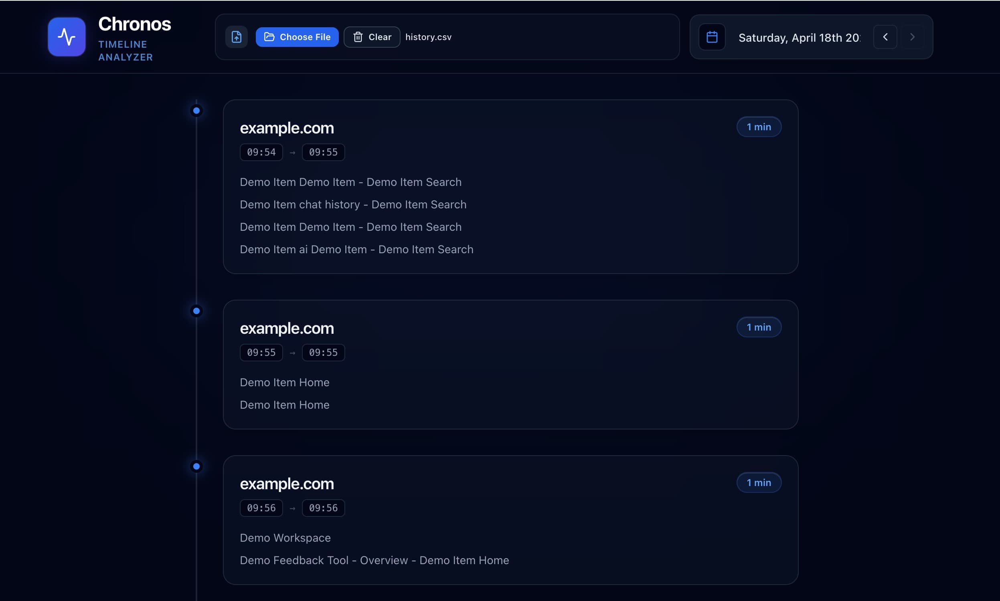

# Chronos

Chronos is a browser-history timeline viewer. It takes an exported browsing history CSV and turns it into a day-by-day activity timeline grouped by domain and short browsing sessions.



## Features

- Drag-and-drop CSV upload with file picker fallback
- Automatic restore of the last uploaded CSV using IndexedDB
- Date-based navigation with deep-linkable URL hash state
- Session grouping by domain using a 15-minute threshold
- Clean timeline cards with start time, end time, duration, and visited page titles
- Domain exclusions for high-noise sources such as YouTube, Facebook, ChatGPT, Gemini, and Reddit

## Tech Stack

- **Framework**: React 19
- **Language**: TypeScript
- **Build Tool**: Vite 8
- **Styling**: Tailwind CSS
- **Animation**: Framer Motion
- **CSV Parsing**: Papa Parse
- **Date UI**: react-datepicker + date-fns
- **Persistence**: IndexedDB

## How It Works

Chronos parses rows from a browser history CSV, extracts the domain for each URL, filters excluded domains, sorts everything chronologically, and groups adjacent visits into session blocks.

Each session block is defined by:

- the same domain
- less than or equal to 15 minutes between visits

The UI then renders those blocks into a vertical daily timeline showing:

- domain name
- start and end time
- computed duration
- page titles for the visits within the session

## Screenshot

The screenshot above shows the main loaded state of the app: a compact header with upload controls and date navigation, followed by timeline cards for each grouped browsing session.

## Getting Started

### Prerequisites

- Node.js 20+ recommended
- npm

### Install

```bash
npm install
```

### Start the App

```bash
npm run dev
```

Open the local Vite URL shown in the terminal.

## Usage

Chronos supports two ways of loading data:

### Option 1: Upload a CSV

Use the upload area in the UI to:

- drag and drop a CSV file
- open the file picker manually

After a successful upload, the CSV contents are saved in IndexedDB and restored automatically on reload.

### Option 2: Ship a Default File

Place a CSV named `history.csv` in the `public/` directory:

```text
public/history.csv
```

If there is no saved upload in IndexedDB, the app will attempt to load this file on startup.

## CSV Format

Chronos currently expects a header-based CSV with fields matching this shape:

| Column | Required | Notes |
|---|---|---|
| `order` | no | Preserved from export, not used for rendering |
| `id` | no | Used when present, otherwise a generated id is created |
| `date` | yes | Used with `time` to build timestamps |
| `time` | yes | Used with `date` to build timestamps |
| `title` | no | Displayed in the timeline |
| `url` | yes | Used for domain extraction and outbound links |
| `visitCount` | no | Not currently displayed |
| `typedCount` | no | Not currently displayed |
| `transition` | no | Parsed and stored, not currently displayed |

Example:

```csv
order,id,date,time,title,url,visitCount,typedCount,transition
1,123,2026-04-18,09:54,Product Overview,https://demo-site.com/overview,1,0,link
2,124,2026-04-18,09:55,Team Workspace,https://workspace.example/home,1,0,link
```

## Data Persistence

Uploaded files are stored locally in the browser using IndexedDB.

What this means:

- the latest uploaded CSV survives reloads
- the saved data is local to that browser profile
- there is no backend or server-side storage in this project

You can remove the saved file from the UI with the clear action.

## Privacy Notes

Chronos runs entirely in the browser. CSV parsing and timeline generation happen client-side.

Important caveat:

- links in the timeline are clickable and open the original URLs in a new tab
- uploaded CSV contents remain in IndexedDB until cleared
- this is a visualization tool, not a redaction or anonymization layer

If you are preparing a demo, use anonymized history data or a sanitized screenshot.

## Project Structure

```text
src/
  components/
    DatePicker.tsx
    HistoryUpload.tsx
    Timeline.tsx
  lib/
    parser.ts
    storage.ts
    types.ts
  App.tsx
  main.tsx
public/
  favicon.svg
  icons.svg
Screenshot.jpg
```

Key files:

- [src/App.tsx](./src/App.tsx): application state, startup flow, upload handling, and hash-based date navigation
- [src/components/Timeline.tsx](./src/components/Timeline.tsx): session timeline rendering
- [src/components/HistoryUpload.tsx](./src/components/HistoryUpload.tsx): drag-and-drop/file picker upload UI
- [src/lib/parser.ts](./src/lib/parser.ts): CSV parsing, domain extraction, exclusion filtering, and session grouping
- [src/lib/storage.ts](./src/lib/storage.ts): IndexedDB persistence for uploaded CSV content
- [src/lib/types.ts](./src/lib/types.ts): shared data contracts

## Available Scripts

```bash
npm run dev
npm run lint
npm run build
npm run preview
```

What they do:

- `npm run dev`: starts the Vite dev server
- `npm run lint`: runs ESLint across the project
- `npm run build`: runs TypeScript project build mode and creates a production bundle
- `npm run preview`: serves the built output locally

## Current Behavior and Limitations

- Session grouping is based only on domain + a 15-minute threshold
- Invalid or malformed dates fall back to `new Date()` behavior during parsing
- Excluded domains are hardcoded in `src/lib/parser.ts`
- The app is single-user and browser-local
- There is no import wizard, schema validation UI, or export flow yet
- The timeline view is designed for browsing, not analytics or reporting

